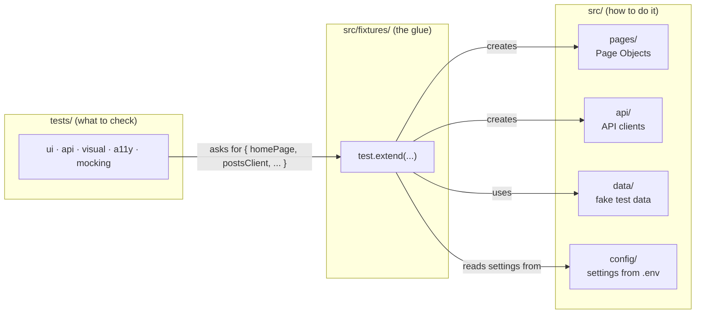
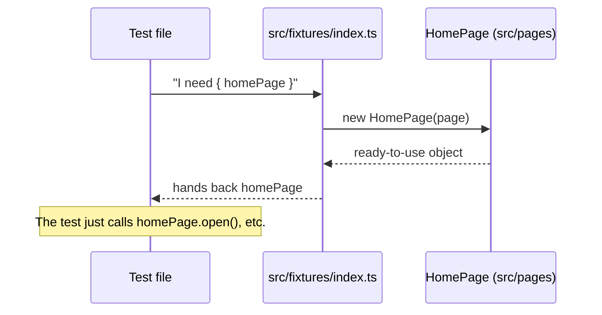

# Architecture

This page explains why the project is built the way it is. If you're wondering "why is this folder here" or "why did we choose this instead of that," this is the place to look.

**In this doc:** [The big picture](#the-big-picture) · [Why fixtures](#why-we-use-fixtures-instead-of-building-objects-by-hand) · [Why src vs tests](#why-test-code-and-app-code-live-in-different-folders) · [Why grouped by type](#why-tests-are-grouped-by-type-not-by-feature) · [What's deferred](#what-were-deliberately-not-doing-yet)

---

## The big picture

At a glance, here's how the pieces connect. `tests/` describes **what** to check; `src/` describes **how** to do it; `src/fixtures/` is the glue that hands the right tools to each test automatically.



> Diagrams on this page use [Mermaid](https://mermaid.js.org/). GitHub and most modern editors render them automatically. If yours shows plain text instead of a picture, you may need a Mermaid preview extension.

A test never builds a `HomePage` or an API client itself — it just asks for one by name, and `src/fixtures/index.ts` hands it over, already set up.

---

## Why we use "fixtures" instead of building objects by hand

A **fixture** is just a ready-made object that Playwright hands to your test before it runs, so you don't have to build it yourself every time.

Instead of writing this in every single test:

```ts
const homePage = new HomePage(page);
```

We set it up once, and every test just asks for `homePage` and gets it automatically:

```ts
test('example', async ({ homePage }) => {
  // homePage is ready to use here
});
```

Here's what actually happens behind the scenes when a test does that:



This saves typing, but the bigger reason is consistency: every test gets set up (and cleaned up) the same way, without anyone needing to remember to do it by hand. It's also the approach the Playwright team itself recommends.

> **Considered and rejected:** the Screenplay Pattern, used by some large test suites, where "Actors" perform "Tasks." It's a good pattern, but it's built for very large teams working across many products at once. For a project this size, it would add complexity we don't need yet — worth another look only if this project grows a lot.

---

## Why test code and app code live in different folders

Everything reusable — Page Objects, API clients, fixtures, test data, config — lives in `src/`. The actual test files live in `tests/`.

This keeps two jobs separate:
- `src/` describes **how** to do things (click this button, call this API).
- `tests/` describes **what** we're checking (open the page, do the thing, check the result).

It also means the code in `src/` gets checked and linted the same way as any other TypeScript code, not treated as a special case.

---

## Why tests are grouped by type, not by feature

Tests live in folders like `tests/ui`, `tests/api`, `tests/visual`, and so on — grouped by **what kind** of check they are, rather than **which feature** they belong to.

This makes it easy to run just one kind of check. For example, "just run the accessibility tests" is one command (`npm run test:a11y`), because the folder, the tag, and the command all line up.

If the project grows large enough that grouping by feature makes more sense later, that's just a case of moving files into different folders. It wouldn't require rebuilding anything underneath.

---

## What we're deliberately not doing yet

| Not doing yet | Why |
|---|---|
| Testing individual UI components | No real components to test yet — there's no real app behind this project |
| Performance testing | More useful once there's a real app with real speed targets to measure against |
| Running tests automatically on every code change (CI) | Nobody's asked for this yet. The commands already set up in `package.json` are exactly what a CI system would call, so adding this later is a small step, not a rebuild |
