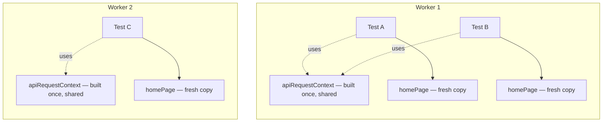
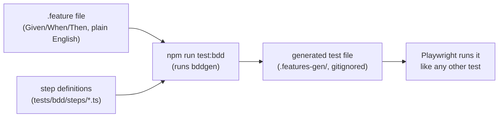

# Writing Tests

Want to know how to write a test the right way in this project? Start here. For a map of which folder holds which kind of test, see [How the project is laid out in the README](../README.md#how-the-project-is-laid-out).

**In this doc:** [Locators](#how-to-find-things-on-the-page-locators) · [Tags](#labeling-tests-with-tags) · [Fixture scope](#fixtures-fresh-per-test-or-shared) · [No timed waits](#dont-use-timed-waits) · [Visual](#visual-tests-screenshot-comparisons) · [Accessibility](#accessibility-tests) · [Mocking](#faking-network-responses-mocking) · [BDD](#bdd-tests-given-when-then)

---

## How to find things on the page (locators)

When a test needs to click a button or read some text, it needs a way to find that element on the page. Playwright calls this a **locator**.

Use these, in this order:
1. `getByRole` — finds things the way a screen reader would (a button, a heading, a link). This is the most reliable choice, so reach for it first.
2. `getByLabel` / `getByPlaceholder` — good for form fields.
3. `getByTestId` — a custom ID added just for testing.
4. `getByText` — finds something by its visible text.

> **Avoid:** CSS selectors, XPath, or picking "the 3rd item in a list" (`.nth()`). These break easily whenever the page's design changes even slightly. Our linter will warn you if you use `.nth()`.

---

## Labeling tests with tags

Every group of tests (a `test.describe` block) should carry a tag that matches its folder:

| Folder | Tag | Command to run it |
|---|---|---|
| `tests/ui/smoke` | `@smoke` | `npm run test:smoke` |
| `tests/ui/regression` | `@regression` | `npm run test:regression` |
| `tests/api` | `@api` | `npm run test:api` |
| `tests/visual` | `@visual` | `npm run test:visual` |
| `tests/a11y` | `@a11y` | `npm run test:a11y` |
| `tests/mocking` | `@mocking` | `npm run test:mocking` |
| `tests/bdd` | `@bdd` | `npm run test:bdd` |

A **smoke test** is a quick check that the basics still work. A **regression test** is a deeper check that something which used to work still works after a change.

---

## Fixtures: fresh per test, or shared

Playwright runs tests at the same time using several "workers" — think of a worker as one lane on a highway, where several tests can drive through at once, each in its own lane.

Fixtures, defined in `src/fixtures/index.ts`, are set up in one of two ways:

- **Fresh per test** (the default): a brand new copy is created for every single test. Use this for anything tied to the browser page itself, like `homePage`, since Playwright gives every test its own fresh page.
- **Shared per worker**: one copy is made and reused by every test that runs in the same worker. Use this for things with no state that could leak between tests, like the API connection (`apiRequestContext`/`postsClient`). Reusing it saves the time of rebuilding it for every single test.



Each test gets its own `homePage`, but tests sharing a worker reuse the same `apiRequestContext` instead of rebuilding it each time.

Simple rule of thumb: if it depends on the page, or holds information that must never carry over from one test to the next, keep it fresh per test. Otherwise, share it per worker.

---

## Don't use timed waits

> **Never:** write `page.waitForTimeout(2000)` to "just wait a couple seconds and hope it's ready." Our linter blocks this.

Instead, use an assertion that waits and retries automatically, like:

```ts
await expect(locator).toBeVisible();
```

This is both faster (it doesn't wait longer than it needs to) and more reliable (it won't fail just because the page happened to be a bit slow that one time).

---

## Visual tests (screenshot comparisons)

A **visual test** takes a screenshot of the page and compares it against a saved reference image, called a **baseline**. If anything looks different, the test fails.

Baselines are saved next to their test file and **are committed to the repo** — they're not a throwaway file, they're the thing we compare against. If you intentionally change how a page looks, update the baseline with `npm run test:visual:update`, look at the new image to make sure it's correct, and then commit it.

---

## Accessibility tests

**Accessibility** (often shortened to "a11y") means checking that a page can be used by people relying on screen readers, keyboards, or other assistive tools.

Use the `checkA11y(page)` fixture in your test — it runs an automated scan and fails the test if it finds any problems. You shouldn't need to write this scan by hand.

---

## Faking network responses (mocking)

Sometimes you want to test how a page behaves when an API call fails or returns something unusual, without actually breaking the real API. Playwright lets you intercept a network request and fake the response — this is called **mocking**.

> **Rule:** always limit the mock to the exact URL you're faking (see `tests/mocking/posts-error-state.spec.ts` for an example). A mock that's too broad can accidentally catch requests you didn't mean to fake, hiding real problems instead of catching them.

---

## BDD tests (Given, When, Then)

**BDD** (Behavior-Driven Development) means writing a test scenario as a short story, in plain English, before writing any code for it: **Given** some starting situation, **When** something happens, **Then** something should be true. This project uses the [playwright-bdd](https://github.com/vitalets/playwright-bdd) library to turn scenarios written this way into real, runnable Playwright tests.

A BDD test has two halves, both under `tests/bdd/`:

- **`features/*.feature`** — the scenario itself, written in a format called **Gherkin**. This is the part meant to be readable by anyone, technical or not.
- **`steps/*.ts`** — the **step definitions**: regular TypeScript that matches each line of the scenario to real code (open a page, click something, check something).

For example, `tests/bdd/features/get-started.feature` reads:

```gherkin
Feature: Navigating from the home page to the docs

  @bdd
  Scenario: Visitor follows the Get started link
    Given I am on the Playwright home page
    When I click the Get started link
    Then I should land on the getting-started docs page
```

And `tests/bdd/steps/get-started.steps.ts` matches each line to real code, using the exact same fixtures (`homePage`, `page`, and so on) as every other test in this project:

```ts
import { createBdd } from 'playwright-bdd';
import { test, expect } from '../../../src/fixtures';

const { Given, When, Then } = createBdd(test);

Given('I am on the Playwright home page', async ({ homePage }) => {
  await homePage.open();
});

When('I click the Get started link', async ({ homePage }) => {
  await homePage.clickGetStarted();
});

Then('I should land on the getting-started docs page', async ({ page }) => {
  await expect(page).toHaveURL(/.*intro/);
});
```

Here's how a `.feature` file actually turns into a test that runs:



A few things worth knowing:

- Run `npm run test:bdd` to try it — this regenerates the real test files from your `.feature` + step files, then runs them. You don't run `.feature` files directly.
- The generated files under `.features-gen/` are build output, like `test-results/` or `playwright-report/`. They're gitignored — never edit them by hand, and never commit them.
- Step definitions import `test` (and `expect`) from `../../../src/fixtures`, the same shared fixtures file every other test type uses. This is what lets a `Given`/`When`/`Then` step use `homePage`, `postsClient`, or anything else defined there.
- Reuse steps across scenarios where the wording matches exactly — you don't need a new step definition for every scenario, only for new *kinds* of steps.

> **If you see `createBdd() should use 'test' extended from "playwright-bdd"` or `Can't guess test instance`:** something is importing `test` from the wrong place. `src/fixtures/index.ts` must extend `test` from `playwright-bdd` (not `@playwright/test` directly), and `playwright.config.ts`'s `defineBddConfig({ steps: [...] })` must include `src/fixtures/index.ts` in its `steps` pattern so `bddgen` can find it.
